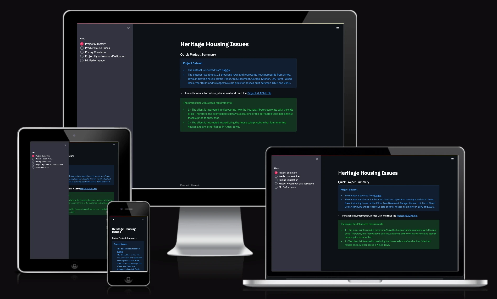
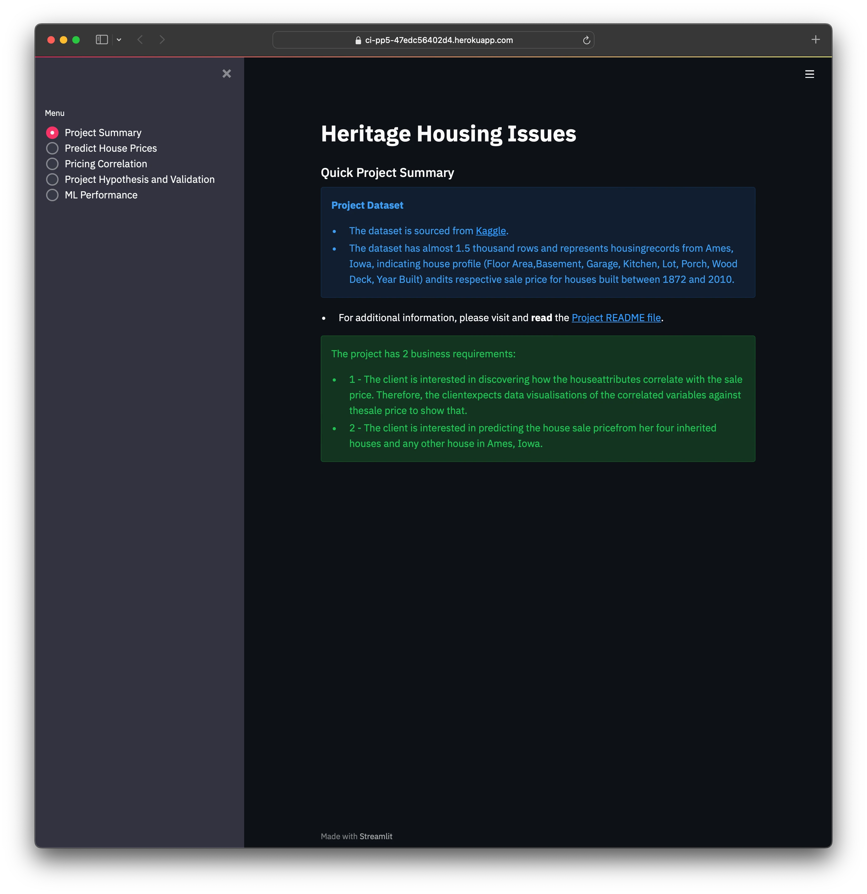
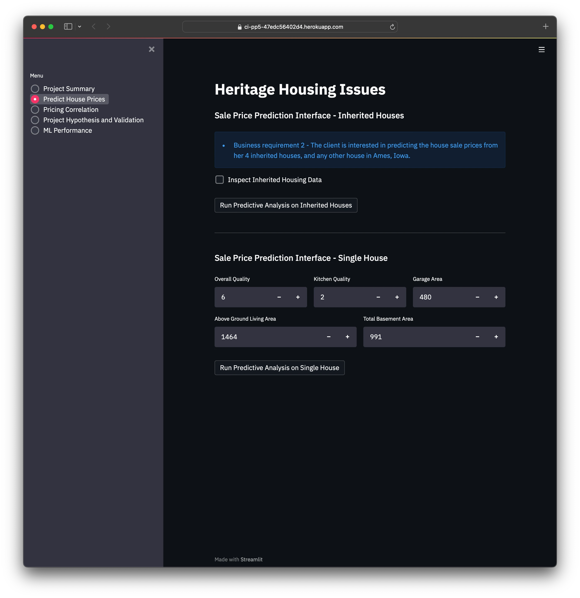
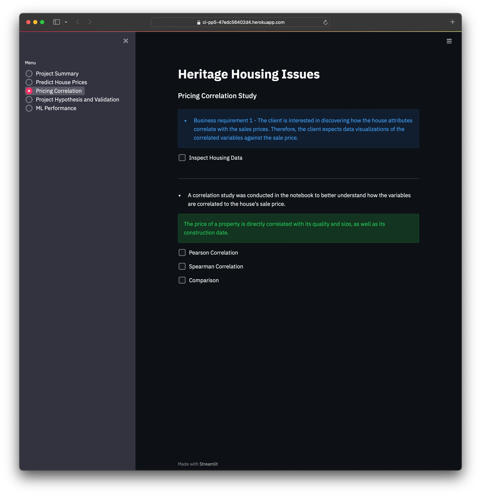
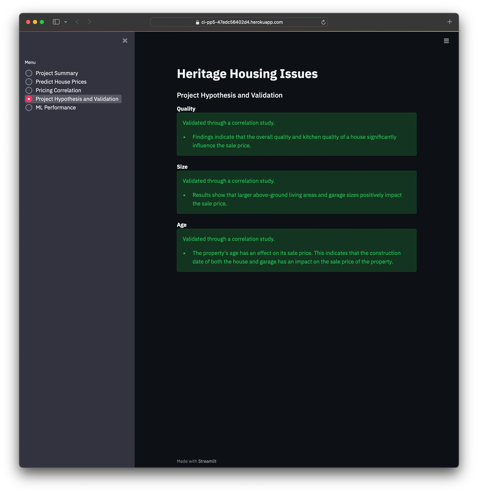
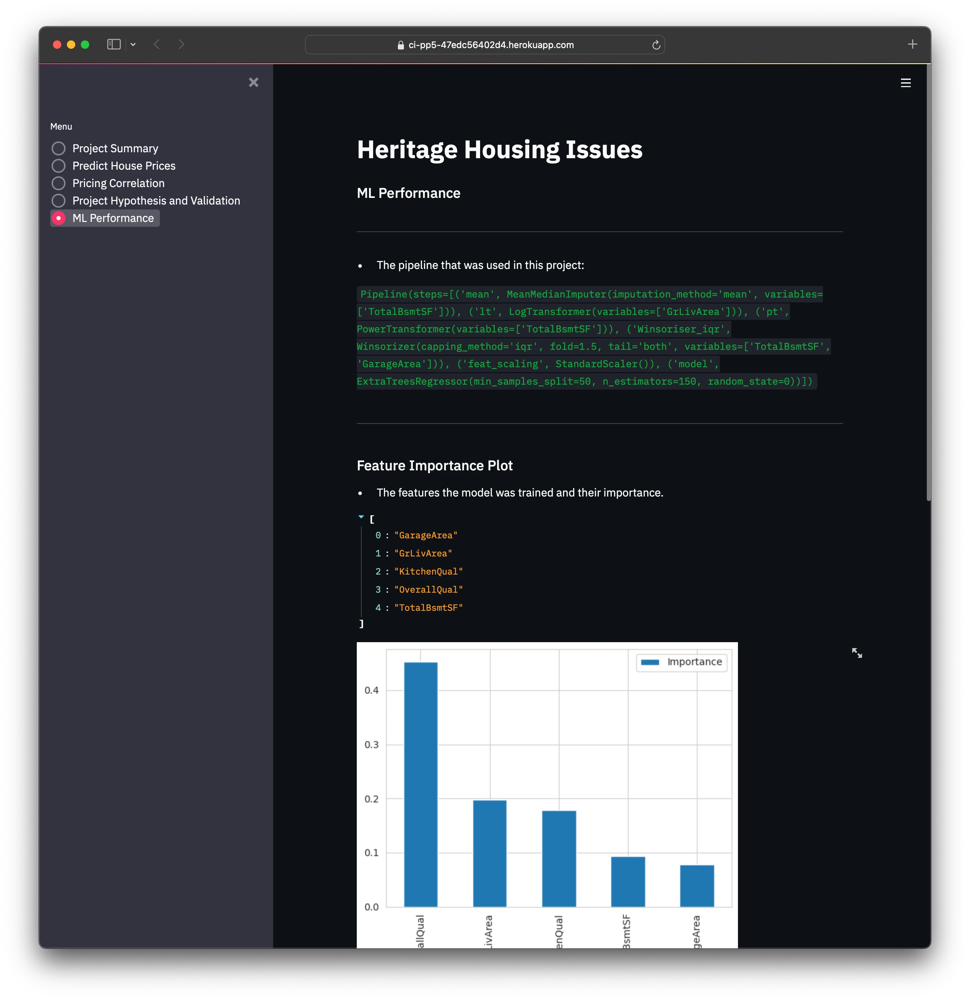

# Heritage Housing Issues

**Heritage Housing Issues** is a Machine Learning project that aims to help users to predict the sale prices of
houses in Ames, Iowa.
The project is hosted here: [DEPLOYED LINK](https://ci-pp5-47edc56402d4.herokuapp.com/)

## Contents
- [Heritage Housing Issues](#heritage-housing-issues)
- [Dataset Content](#dataset-content)
- [Business Requirements](#business-requirements)
- [Hypothesis and how to validate?](#hypothesis-and-how-to-validate)
    * [Quality](#quality)
    * [Size](#size)
    * [Age](#age)
- [The rationale to map the business requirements to the Data Visualisations and ML tasks](#the-rationale-to-map-the-business-requirements-to-the-data-visualisations-and-ml-tasks)
    * [Business Requirement 1](#business-requirement-1)
    * [Business Requirement 2](#buisness-requirement-2)
- [ML Business Case](#ml-business-case)
- [User Stories](#user-stories)
- [Dashboard Design](#dashboard-design)
    * [Page 1: Project Summary](#page-1-project-summary)
    * [Page 2: Predict House Prices](#page-2-predict-house-prices)
    * [Page 3: Pricing Correlation](#page-3-pricing-correlation)
    * [Page 4: Project Hypothesis and Validation](#page-4-project-hypothesis-and-validation)
    * [Page 5: ML Performance](#page-5-ml-performance)
- [Testing](#testing)
    * [Validation](#validation)
- [Unfixed Bugs](#unfixed-bugs)
- [Deployment](#deployment)
    * [Heroku](#heroku)
- [Main Data Analysis and Machine Learning Libraries](#main-data-analysis-and-machine-learning-libraries)
- [Credits](#credits)
- [Acknowledgements](#acknowledgements)

## Dataset Content
* The dataset is sourced from [Kaggle](https://www.kaggle.com/codeinstitute/housing-prices-data). We then created a fictitious user story where predictive analytics can be applied in a real project in the workplace.
* The dataset has almost 1.5 thousand rows and represents housing records from Ames, Iowa, indicating house profile (Floor Area, Basement, Garage, Kitchen, Lot, Porch, Wood Deck, Year Built) and its respective sale price for houses built between 1872 and 2010.

|Variable|Meaning|Units|
|:----|:----|:----|
|1stFlrSF|First Floor square feet|334 - 4692|
|2ndFlrSF|Second-floor square feet|0 - 2065|
|BedroomAbvGr|Bedrooms above grade (does NOT include basement bedrooms)|0 - 8|
|BsmtExposure|Refers to walkout or garden level walls|Gd: Good Exposure; Av: Average Exposure; Mn: Minimum Exposure; No: No Exposure; None: No Basement|
|BsmtFinType1|Rating of basement finished area|GLQ: Good Living Quarters; ALQ: Average Living Quarters; BLQ: Below Average Living Quarters; Rec: Average Rec Room; LwQ: Low Quality; Unf: Unfinshed; None: No Basement|
|BsmtFinSF1|Type 1 finished square feet|0 - 5644|
|BsmtUnfSF|Unfinished square feet of basement area|0 - 2336|
|TotalBsmtSF|Total square feet of basement area|0 - 6110|
|GarageArea|Size of garage in square feet|0 - 1418|
|GarageFinish|Interior finish of the garage|Fin: Finished; RFn: Rough Finished; Unf: Unfinished; None: No Garage|
|GarageYrBlt|Year garage was built|1900 - 2010|
|GrLivArea|Above grade (ground) living area square feet|334 - 5642|
|KitchenQual|Kitchen quality|Ex: Excellent; Gd: Good; TA: Typical/Average; Fa: Fair; Po: Poor|
|LotArea| Lot size in square feet|1300 - 215245|
|LotFrontage| Linear feet of street connected to property|21 - 313|
|MasVnrArea|Masonry veneer area in square feet|0 - 1600|
|EnclosedPorch|Enclosed porch area in square feet|0 - 286|
|OpenPorchSF|Open porch area in square feet|0 - 547|
|OverallCond|Rates the overall condition of the house|10: Very Excellent; 9: Excellent; 8: Very Good; 7: Good; 6: Above Average; 5: Average; 4: Below Average; 3: Fair; 2: Poor; 1: Very Poor|
|OverallQual|Rates the overall material and finish of the house|10: Very Excellent; 9: Excellent; 8: Very Good; 7: Good; 6: Above Average; 5: Average; 4: Below Average; 3: Fair; 2: Poor; 1: Very Poor|
|WoodDeckSF|Wood deck area in square feet|0 - 736|
|YearBuilt|Original construction date|1872 - 2010|
|YearRemodAdd|Remodel date (same as construction date if no remodelling or additions)|1950 - 2010|
|SalePrice|Sale Price|34900 - 755000|

## Business Requirements
As a good friend, you are requested by your friend, who has received an inheritance from a deceased great-grandfather located in Ames, Iowa, to  help in maximising the sales price for the inherited properties.

Although your friend has an excellent understanding of property prices in her own state and residential area, she fears that basing her estimates for property worth on her current knowledge might lead to inaccurate appraisals. What makes a house desirable and valuable where she comes from might not be the same in Ames, Iowa. She found a public dataset with house prices for Ames, Iowa, and will provide you with that.

* 1 - The client is interested in discovering how the house attributes correlate with the sale price. Therefore, the client expects data visualisations of the correlated variables against the sale price to show that.
* 2 - The client is interested in predicting the house sale price from her four inherited houses and any other house in Ames, Iowa.

## Hypothesis and how to validate?
* List here your project hypothesis(es) and how you envision validating it (them).
### Quality
Validated through a correlation study.
- Findings indicate that the overall quality and kitchen quality of a house significantly influence the sale price.
### Size
Validated through a correlation study.
- Results show that larger above-ground living areas and garage sizes positively impact the sale price.
### Age
Validated through a correlation study.
- The property's age has an effect on its sale price. This indicates that the construction date of both the house and garage has an impact on the sale price of the property.

## The rationale to map the business requirements to the Data Visualisations and ML tasks
### Business Requirement 1
The client is interested in discovering how the house attributes correlate with the sale price. Therefore, the client expects data visualisations of the correlated variables against the sale price to show that.

* The house attributes will be correlated with the sale prices using conventional data analysis.
* Correlation and PPS study to be completed - Spearman, Pearson and Predictive Power Score (PPS). There will be a visual representation of these using heatmaps
* A scatter plot will be used to illustrate the correlation between different features and the sale price.

### Buisness Requirement 2
The client is interested in predicting the house sale price from her four inherited houses and any other house in Ames, Iowa.

* The data indicates the need for a regressor with the sale price as the target variable.
* Feature engineering will be applied to compare various transformations.
* A pipeline will be constructed based on the optimal transformations and the most significant features.
* The agreement with the client requires an R2 score of at least 0.75 on both the training and test sets.

## ML Business Case
* We want an ML model to predict the sale price of different houses in the Ames, Iowa region.
* The model should have an R2 score of at least 0.75 on both the train and the test sets.
* The training data comes from a public dataset and contains about 1500 records and have 22 features.
* The output is an numerical value representing the predicted sale price in USD.

## User Stories
- As a user, I want to identify which house attributes are most correlated with the sale price to ensure accurate predictions based on the right features.
- As a user, I want a dashboard to display the prediction results effectively.
- As a user, I want interactive input widgets to input real-time house data and predict the sale price.
- As a user, I want to see relevant plots to visualize the relationships between sale price and other features.
- As a user, I want to see relevant plots to visualize the relationships between sale price and other features.
- As a user, I want to know the source and content of the training data to be confident in the model's quality.
- As a user, I want to evaluate the model's performance to ensure the reliability of the predictions.

## Dashboard Design
### Page 1: Project Summary

### Page 2: Predict House Prices

### Page 3: Pricing Correlation

### Page 4: Project Hypothesis and Validation

### Page 5: ML Performance

## Testing
### Validation
No errors were found when passing through the [CI Python Linter](https://pep8ci.herokuapp.com/#).
### Manual Testing

## Unfixed Bugs
No known bugs remaining.

## Deployment
### Heroku
* The App live link is: [Heritage Housing Issues](https://ci-pp5-47edc56402d4.herokuapp.com/)
* Set the runtime.txt Python version to a [Heroku-20](https://devcenter.heroku.com/articles/python-support#supported-runtimes) stack currently supported version.
* The project was deployed to Heroku using the following steps.
1. Log in to Heroku and create an App
2. At the Deploy tab, select GitHub as the deployment method.
3. Select your repository name and click Search. Once it is found, click Connect.
4. Select the branch you want to deploy, then click Deploy Branch.
5. The deployment process should happen smoothly if all deployment files are fully functional. Click the button Open App on the top of the page to access your App.
6. If the slug size is too large then add large files not required for the app to the .slugignore file.

## Main Data Analysis and Machine Learning Libraries
* [pandas](https://pandas.pydata.org)
    - Used to read/write and manipulate CSV data 
* [NumPy](https://numpy.org)
    - Used to generate arrays of random numbers 
* [feature-engine](https://feature-engine.trainindata.com/en/latest/)
    - Used to compare transformers in feature engineering notebook.
* [Matplotlib](https://matplotlib.org)
    - Used to visualize the data
* [plotly](https://plotly.com/)
    - Used to visualize the data
* [YData Profiling](https://docs.profiling.ydata.ai/latest/)
    - Used to create an profile report for evaluation
* [seaborn](https://seaborn.pydata.org)
    - Used to create statistical graphs
* [ppscore](https://pypi.org/project/ppscore/)
    - Used to calculate correlations between variables
* [streamlit](https://streamlit.io/)
    - Used to create an user interface
* [scikit-learn](https://scikit-learn.org/stable/)
    - Used to create the ML pipeline

## Credits
* The project was based on the [Code Institute Walkthrough Project 02 - Churnometer](https://github.com/Code-Institute-Solutions/churnometer)
* During the project, I often referred to these chapters in the Code Institute LMS:
    - Data Analysis & Machine Learning Toolkit
    - Develop and Deploy an A.I. System
* I also referred to the documentation in these sites:
    - [pandas](https://pandas.pydata.org)
    - [seaborn](https://seaborn.pydata.org)
    - [streamlit](https://streamlit.io/)

### Acknowledgements
- Thank you to my mentor Mo Shami.\
\
This is my Portfolio Project 5 as part of the Full Stack Software Developer program at [Code Institute](https://codeinstitute.net/).\
David Eriksson 2024